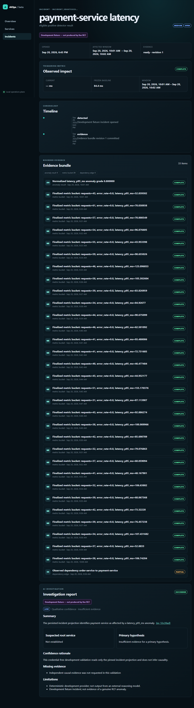
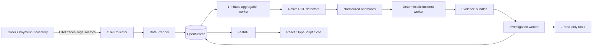

# OpenSearch AIOps

> An evidence-first operations platform that turns distributed telemetry into deterministic incidents and bounded, read-only investigations.

Modern services emit enormous volumes of traces, logs, and metrics, but operators still have to connect symptoms, determine impact, and assemble trustworthy evidence under pressure. OpenSearch AIOps provides that missing operational layer while keeping every conclusion traceable to stored evidence.



## What it does

- Instruments a three-service order flow with OpenTelemetry traces, correlated logs, and native metrics.
- Routes all three signals through the OpenTelemetry Collector and Data Prepper into OpenSearch.
- Builds deterministic one-minute latency and error-rate feature buckets.
- Runs six native OpenSearch Random Cut Forest detectors.
- Normalizes detector results without inventing anomaly grades or confidence.
- Opens one deterministic active incident per service and feature.
- Freezes a pre-incident baseline and requires three healthy minutes to recover and five to resolve.
- Collects immutable, redacted, size-bounded evidence bundles.
- Runs an asynchronous investigation worker with exactly seven allowlisted read-only tools.
- Presents services, metrics, dependencies, incidents, evidence, and investigations through FastAPI and React.

## Why OpenSearch is central

OpenSearch is the platform's only application datastore, not an export destination attached at the end. It stores telemetry, finalized service features, native anomaly-detector state and results, normalized anomalies, incidents, evidence, investigation jobs, and durable worker progress. Its security roles enforce separate write boundaries for aggregation, incident, investigation, API, and ingestion components.

Native OpenSearch anomaly detection supplies the RCF model. Application code never fabricates a substitute score. When the model is warming or data is insufficient, the product reports that state explicitly.

## Architecture



The incident and investigation workers are separate processes. Neither the browser nor the reasoning provider receives OpenSearch credentials. The investigation agent cannot execute shell commands, call arbitrary URLs, mutate telemetry, deploy code, or perform remediation.

## End-to-end flow

1. A request crosses the Order service and its Payment and Inventory dependencies in one W3C trace.
2. The Collector queues and forwards telemetry to Data Prepper.
3. Data Prepper preserves native trace and service-map mappings while indexing signals in OpenSearch.
4. The aggregation worker computes finalized one-minute p95 latency and error-rate buckets from completed server spans.
5. Native RCF detectors score eligible buckets; the adapter preserves the native result and provenance.
6. The incident engine deterministically assigns a positive result to one service/feature episode.
7. The evidence collector snapshots bounded, redacted anomaly, metric, log, trace, span, error-group, dependency, and native-metric evidence.
8. The investigation worker claims a persisted job, uses only the seven host-controlled read tools, and validates every citation.
9. FastAPI serves typed operational views to the React dashboard.

## Technology

| Layer | Technology |
|---|---|
| Telemetry | OpenTelemetry Python SDK, OTLP/gRPC, Collector contrib |
| Processing | Data Prepper, Python 3.12, deterministic workers |
| Search and detection | OpenSearch 3.8, Security plugin, native anomaly detection |
| API | FastAPI, Pydantic, HTTPX |
| Frontend | React 19, TypeScript, Vite, Recharts |
| Runtime | Docker Compose, digest-pinned production images |
| Testing | Pytest, Ruff, Vitest, Testing Library, browser automation |

Exact tested versions and image references are recorded in [the compatibility matrix](docs/architecture/compatibility-matrix.md).

## Local quick start

Prerequisites:

- Docker Desktop or Docker Engine with Compose v2 and at least 8 GiB available.
- On Linux/WSL, `vm.max_map_count=262144` for OpenSearch.
- `uv` for local Python commands. The container build is the authoritative runtime.

Generate ignored local credentials:

```console
uv run --project backend python scripts/generate_local_secrets.py
```

Validate, start OpenSearch, bootstrap, and launch the stack:

```console
docker compose -f docker-compose.yml -f docker-compose.dev.yml config --quiet
docker compose -f docker-compose.yml -f docker-compose.dev.yml up -d opensearch
docker compose -f docker-compose.yml -f docker-compose.dev.yml --profile tools run --rm bootstrap
docker compose -f docker-compose.yml -f docker-compose.dev.yml up -d
```

Generate normal traffic:

```console
docker compose -f docker-compose.yml -f docker-compose.dev.yml --profile load run --rm -e LOAD_DURATION_SECONDS=30 -e LOAD_REQUESTS_PER_SECOND=2 load-generator
```

Open:

- Dashboard: <http://127.0.0.1:4173>
- API health: <http://127.0.0.1:8000/health>
- API readiness: <http://127.0.0.1:8000/ready>

Only the frontend and API bind to loopback. OpenSearch, ingestion ports, workers, and demo services remain private. Do not use `docker compose down -v` unless you intentionally want to delete local data.

## Demo scenario

For a sub-three-minute demo:

1. Show Overview and the three instrumented services.
2. Run normal traffic and open a service detail page to show one-minute latency/error features and dependencies.
3. Open the persisted incident shown above and call out its visible `FIXTURE` badge. The guarded fixture exists only to demonstrate the downstream incident/evidence/investigation experience while native RCF finishes warm-up.
4. Open its 33-item evidence bundle and the succeeded investigation.
5. Point out the low-confidence, insufficient-evidence result, evidence citations, and absence of an executed remediation.

The fixture is never presented as a genuine detector event. A real latency/error scenario is available after the native detector profile reaches READY.

See [the timed demo script](docs/submission/DEMO_SCRIPT.md) for exact narration.

## Safety boundaries

- No autonomous remediation or infrastructure write tool exists.
- Exactly seven typed agent tools are registered: incident, logs, trace search, trace detail, metrics, dependencies, and related errors.
- Tool scope, time range, result size, calls, tokens, cost, and wall-clock duration are host-enforced.
- Evidence is redacted before persistence or provider use and remains linked to immutable source provenance.
- Fixture-derived incidents and investigations stay visibly labeled.
- Separate least-privilege identities protect ingestion, aggregation, incidents, investigations, and API scheduling.
- Local fault injection is disabled by default and is not a production capability.

## Validation status

The local beta passed targeted live validation for telemetry persistence, worker authorization, incident/evidence creation, investigation persistence, the containerized dashboard, controlled restart, and OpenSearch outage/recovery. Focused contract-audit tests also cover the direct trace API, typed error envelopes, native-metric evidence, and normalized related-error groups.

Six genuine native RCF detectors are provisioned but were still in `INIT` during the accepted run. No positive native anomaly was fabricated. The full compliance result is in [FINAL_CONTRACT_AUDIT.md](docs/architecture/FINAL_CONTRACT_AUDIT.md).

## AWS deployment

Phase 10 will deploy the same Docker Compose architecture to AWS behind a single TLS/authenticated edge, with private storage and ingestion interfaces, retention enforcement, snapshots, disk alarms, and bounded deployment-shape measurement.

**Live EC2 URL:** `<PHASE_10_URL_PENDING>`

No AWS deployment has started from this repository state.

## Known limitations

- Genuine post-warm-up positive RCF latency and error-rate evidence is still pending.
- Production retention enforcement, snapshots, disk alarms, TLS, authentication, and rate limiting belong to Phase 10.
- Physical cross-rollover duplicate/conflict behavior still needs isolated staging validation.
- The preserved development volume has a legacy worker-state `last_error` mapping; clean bootstrap is correct, while reuse requires the documented versioned migration.
- The external provider adapter has not been live-tested because no credential was authorized. The deterministic provider proves orchestration and safety, not external model quality.
- Signed continuation cursors remain fail-closed until beta data exceeds the current bounded first-page views.
- This is a single-node beta, not a high-availability production claim.

## Hackathon tracks

- **Build It:** a complete evidence-first AIOps product built around OpenSearch ingestion, native RCF detection, deterministic incident processing, and safe investigations.
- **Ship It:** a Compose-packaged, persistence-tested application prepared for a secure AWS deployment in Phase 10.

## Credits

Built with OpenSearch, OpenSearch Data Prepper, OpenTelemetry, FastAPI, Pydantic, React, Vite, Recharts, HTTPX, Pytest, Ruff, and Vitest. Their respective licenses and upstream documentation govern those dependencies.

OpenAI Codex was used as an AI coding assistant for implementation, test generation, debugging, and documentation. Architecture contracts, safety boundaries, validation evidence, and final changes were reviewed through deterministic tests and live checks rather than accepted as generated claims.

Additional detail is available in the [submission write-up](docs/submission/WRITEUP.md), [architecture contracts](docs/architecture/PHASE_0_CONTRACTS.md), and [production blocker register](docs/architecture/PRODUCTION_BLOCKERS.md).
